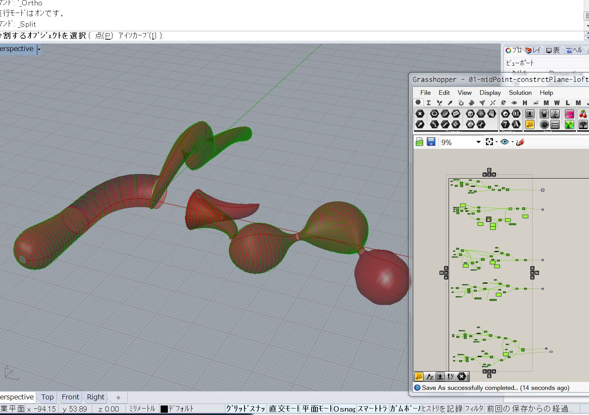
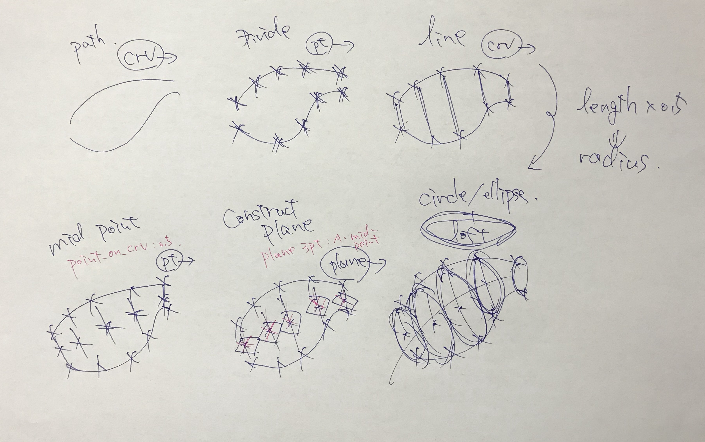
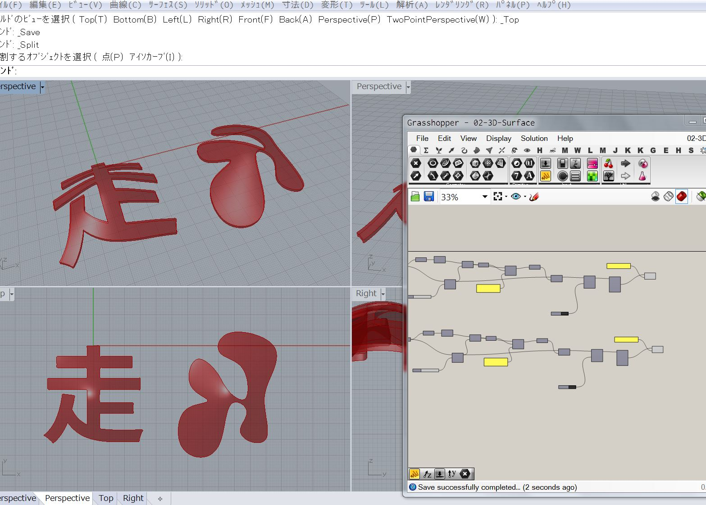
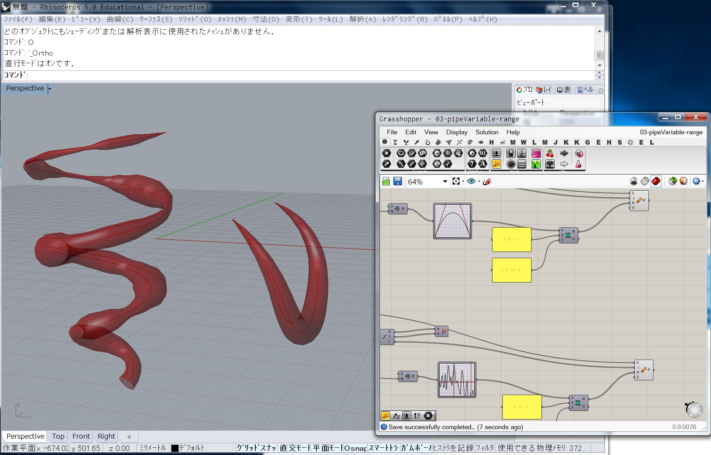

# Study-makeSurface-gh  

---  

### 01-midPoint-constrctPlane-loft  

2本のパス間で、うまく断面パスを作って loft して、良さげな曲面を作る。  

  

  

---  

### 02-3D-Surface  

曲がった面を作る。  

  

---  

### 03-pipeVariable-range  

半径の異なるパイプを、GraphMapper で調整しながら作る。

  
